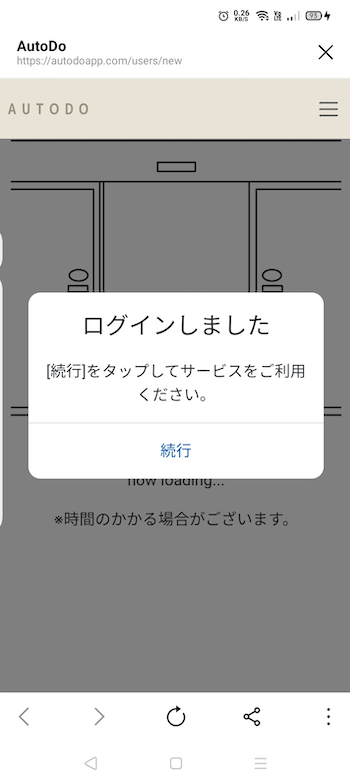

# AutoDo

## 【アプリ URL】

https://autodoapp.com

## 【サービス概要】

スマホを使っていつの間にかダラダラ過ごしてしまう人に
todo リストの中から暇な時間をめがけて
タスクを 1 つピックアップし、配信するサービスです

## 【メインのターゲットユーザー】

- ルーティンを済ませた後、スマホを使ってダラダラしてしまう人
- todo を作成することが面倒だと感じる人

## 【ユーザーが抱える課題】

- ご飯を食べた後お風呂に入った後に何となくスマホを使ってそのまま何時間も経っている
- ぼーっとしているところから何かをするハードルは高い
- 疲れていると todo リストから 1 つ選ぶことが面倒になる

## 【解決方法】

- 暇になる時間を設定しておくことで、その時間にタスクが配信される
- タスクを事前に登録しておき、ピックアップされた 1 つのタスクを教えてくれる

## 【実装予定の機能】

**ユーザー登録・ログイン機能**

- Web トップページから友だち登録のリンクへ飛べる
- LINE ログインができる
- ログアウト機能

**プロフィール登録**

- 夜ご飯の時間、就寝時間、休みの日を設定してもらい以下のように利用する
  - 夜ご飯の時間 → この設定から 1 時間後にタスクを配信
  - 就寝時間 → これ以降には配信しない
  - 休みの日 → タスクの所要時間が長いものを教えてくれる
  - 通知のオンオフ設定

**タスク**

- タスクの登録ができる
- タスクの詳細を確認できる
- タスクを編集できる
- タスクを削除できる
- タスクの一覧表示ができる

**タスクの定期配信機能**

- 夜ご飯の時間から 1 時間後にタスクを毎日配信する
- 就寝時間以降は配信をストップする
- タスクを完了後、次のタスクを配信する
- 平日には所要時間が短時間のタスク、休日には長時間のタスクを配信する
- 全てのタスクが終わった場合はタスクの配信を終了する

**本リリース時の追加機能**

- マイページで実行したタスクのログを確認できる
- 管理者画面よりユーザー、タスクの管理を行えるようにする
- 利用規約・プライバシーポリシー

## 【このサービスを作った思い】

食事の後にスマホを見て気づいたら数時間経っていて後悔したという経験が何度もありました。
ぼーっとしているところからタスクを行動に移すまでにはいくつかのハードルを超える必要があります。
その中でも休むことには制限時間がないことや todo リストを考えないといけないことが要因になっていると感じていました。
これらを解決できるようなサービスが欲しいと考え、このアプリを作りました。

## 【類似サービスとの相違点】

- タスクをリストから自動で一つ選んでくれる
- 所要時間が長いものは休日、所要時間の短いものは平日と分けてタスクをお知らせする
- 暇な時間を狙ってタスクを教えてくれる

## 【使用技術】

**バックエンド**

- Ruby 3.2.2
- Rails 7.0.6

**フロントエンド**

- Bootstrap 5.2.3
- LIFF(LINE Front-end Framework)
- LINE Messaging API
- JavaScript

**インフラ**

- fly.io

## 【スケジュール】

企画〜技術調査：6/13 〆切 
README〜ER 図作成：7/6 〆切 
メイン機能実装：7/6 - 9/19 
β 版を RUNTEQ 内リリース（MVP）：9/20 〆切 
本番リリース：10/23

[画面遷移図](https://www.figma.com/file/Zag0Ou5iA97zARoYnyeV9j/%E7%94%BB%E9%9D%A2%E9%81%B7%E7%A7%BB%E5%9B%B3?type=design&node-id=0%3A1&mode=design&t=be3I1J8ECO3r8Iu9-1)

## 【ER 図】

## 【現在確認している不具合】

- 以下の画面表示が出て、[続行]をタップしてもログイン状態にならない不具合が発生しています。 
  原因については現在調査中です。 

   

  **対処法** 

  1. LINE アプリ上から「デフォルトのブラウザで開く」をクリック
  2. スマホのブラウザに遷移してログインを行う 

  修正までしばらくお待ちください。
